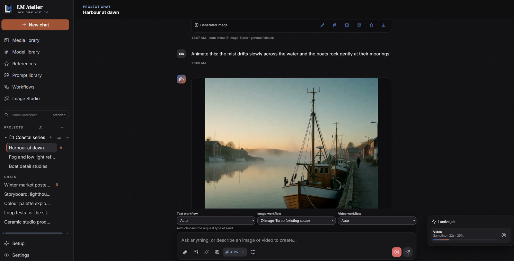

<p align="center">
  <a href="https://github.com/ajccarlson/lm-atelier">
    
  </a>
</p>

# LM Atelier

LM Atelier is a local-first workspace for AI chat, image creation and editing,
video generation, and vision-assisted context. It keeps conversations and media
on your computer by default and can select an appropriate configured model for
each request.



## Core features

- Local chat, image generation and editing, and video generation
- Vision context for images and representative video frames
- Auto Mode for routing requests to configured models
- One-click installation for models with supported, runtime-verified formats
- Contextual image creation and editing within conversations
- Durable queues, regeneration history, per-chat settings, and reusable presets
- Local model, media, conversation, and storage management

## Technology

LM Atelier uses React, TypeScript, FastAPI, Python, SQLAlchemy, SQLite,
llama.cpp, ComfyUI, Vitest, Pytest, and Playwright. The browser interface and
local API run together on the user's computer.

## Install

Download the latest installer and its `SHA256SUMS` file from
[Releases](https://github.com/ajccarlson/lm-atelier/releases/latest).

### Windows

Run `LM-Atelier-Setup-<version>-windows-x86_64.exe`, then open **LM Atelier**
from the Start menu, desktop shortcut, or installation folder. Keep the
LM Atelier terminal open while using the app; closing it stops the local
service.

### Linux

Run `LM-Atelier-Setup-<version>-linux-x86_64.run`:

```sh
chmod +x LM-Atelier-Setup-*-linux-x86_64.run
./LM-Atelier-Setup-*-linux-x86_64.run
```

The installers do not require a separate Python or Node.js installation.
Models and optional inference engines are downloaded separately and retain
their own licenses and hardware requirements.

LM Atelier is currently a preview targeting Windows 11 x64 and Ubuntu 24.04
LTS x64. Managed llama.cpp chat setup is one-click on both installer targets
where the pinned runtime is compatible. Managed media setup is currently limited
to the reviewed compatible Windows NVIDIA runtime. Linux image/video require an
externally configured compatible media engine and are not certified.
Release binaries are not yet code-signed.

## Local development

Requirements:

- Python 3.12
- Node.js 22.13 or newer
- npm

On Windows PowerShell:

```powershell
py -3.12 -m venv .venv
.\.venv\Scripts\python.exe -m pip install -e '.\services\api[dev,package]'
npm.cmd ci
npm.cmd run build
.\.venv\Scripts\lm-atelier.exe
```

On Linux:

```sh
./scripts/setup.sh
./scripts/start.sh
```

Open `http://127.0.0.1:12340`. To develop without downloading models, copy
`.env.example` to `.env` and keep the chat and media engines set to `mock`.
Never commit `.env` files, credentials, model weights, generated media, or
local databases.

## Validation

The complete Windows gate is:

```powershell
powershell -NoProfile -ExecutionPolicy Bypass -File .\scripts\verify.ps1
```

The complete Linux gate is:

```sh
./scripts/verify.sh
```

The full cross-platform gate also requires Git for Windows with Git Bash on
Windows, or PowerShell 7 on Linux. Install the pinned Chromium build once with
`npm run e2e:install`.

## Documentation

- [Architecture](docs/ARCHITECTURE.md)
- [Runtime adapters](docs/ADAPTERS.md)
- [Privacy and local data](docs/PRIVACY.md)
- [Troubleshooting](docs/TROUBLESHOOTING.md)
- [Contributing](CONTRIBUTING.md)
- [Support](SUPPORT.md)
- [Security policy](SECURITY.md)

## Local data

- Windows: `%LOCALAPPDATA%\LMAtelier\data`
- Linux: `$XDG_DATA_HOME/lm-atelier`, or `~/.local/share/lm-atelier`

Updates preserve local data. Uninstalling also preserves it unless the user
explicitly chooses a purge. See [Privacy and local data](docs/PRIVACY.md) for
retention, deletion, backup, and diagnostic boundaries.

## License

LM Atelier is licensed under the [Apache License 2.0](LICENSE). Models,
workflows, inference engines, custom nodes, and third-party assets remain
subject to their respective licenses and terms. Copyright © 2026 LM Atelier
contributors.

## Maintainer

[Aaron Carlson](https://github.com/ajccarlson)
